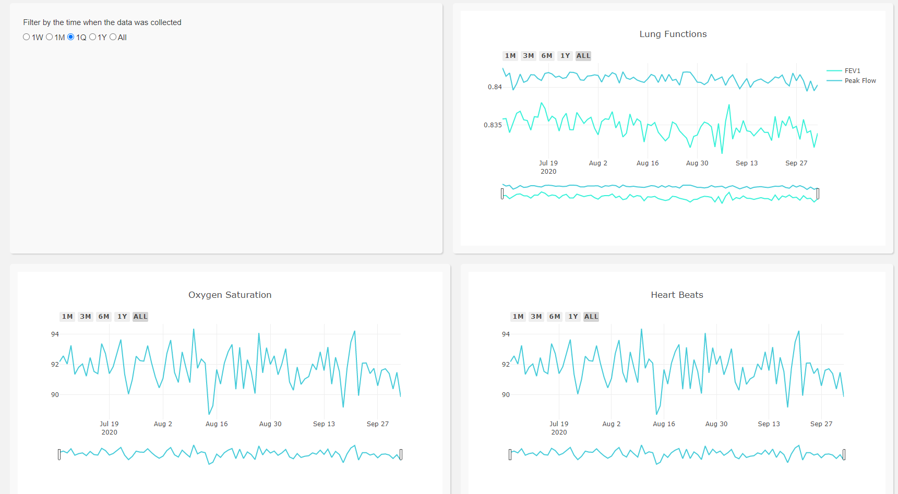

# spyroweb





Use of [Anaconda](https://www.anaconda.com/) is recommended

### Create a conda environment
Open the anaconda terminal with admin access
```bash
    conda create -n yourenvname python=3.6 
```

### activate conda environment
```bash
    conda activate yourenvname
```

### Installing dependencies

```
   pip install -r requirements.txt
```

### Start the app
```
    python app.py
```

### Using the live Database
if using mongodb then change the 23rd line in app.py `database = db_mock()` with `db_transform("Adress", 'db_name', 'user_id')`

for more information on `db_trasform()` please check [database.py](https://github.com/jay-chakalasiya/spyroweb/blob/main/database.py) file


## Important Files

```bash

Root
|   .gitignore                # Ignored Files
|   app.py                    # Main file for the app interface
|   config.py                 # Global Data Configuration variables
|   database.py               # Functions which fetches and provides data to plotting function
|   Dockerfile                
|   explore.ipynb
|   file_structure.txt          
|   graphs.py                 # Code to print graphs
|   Procfile                  # For heroku deployment
|   README.md            
|   requirements.txt          # dependencies
|
+---assets\                   # Custom CSS and Javascripts
|       
+---data                      # Static data files(in case the live database is not online)
|       dash-logo copy.png
|       data_activity.csv
|       data_fev1.csv
|       data_o2.csv
|       data_pef.csv
|       data_pulse.csv
|       data_sleep.csv
```


References
- For Core elements - [Dash Core Components](https://dash.plotly.com/dash-core-components)
- For HTML Elements - [Dash HTML Elements](https://dash.plotly.com/dash-html-components)
- All other documentation - [Docs](https://dash.plotly.com/)